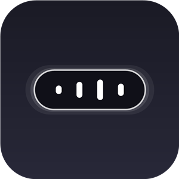

  
  <h1>MediaPeek</h1>
  
<b>不占屏幕的 Windows 顶部媒体卡片 —— 光标贴住屏幕顶边，正在播放滑出来</b>

  
A zero-footprint media card for Windows: rest the pointer on the top edge and what's playing slides into view.

  

    
    
  

## 这是什么

MediaPeek 把「正在播放」做成一张贴在屏幕顶边的小卡片：平时完全隐藏、不占一像素屏幕，想看的时候光标往顶边一贴，封面、歌名、歌手就滑出来；点一下播放/暂停，滑一下切歌，然后它自己悄悄收回去。

不用切窗口，不用在任务栏找播放器，全屏看视频、打游戏时也一样能用。

## 功能亮点

- **零屏幕占用**：卡片隐藏时按像素点击穿透，不妨碍你点下面的任何窗口
- **贴边唤出**：光标贴住屏幕顶边停留约 0.15 秒唤出，离开约 0.6 秒自动收起
- **自动现身**：网易云切歌即时浮现报歌名；播放中每分钟轻轻提示一次（3.5 秒）
- **纯手势控制**：点击卡片 = 播放/暂停，左右横滑 = 上/下一首；不习惯手势可在托盘菜单切成按钮
- **氛围细节**：封面取色氛围光、播放中描边流光，两段式「先歌名、后封面歌手」展开动画
- **安静常驻**：置顶但不抢焦点，无任务栏按钮、不出现在 Alt+Tab，只在托盘留一个图标

## 下载与运行

1. 到 [Releases](https://github.com/GitHub-Coder-xu/MediaPeek/releases/latest) 下载 `MediaPeek.exe`（单文件、免安装，自包含运行时）
2. 双击运行，图标常驻右下角托盘；首次运行会播放一段使用引导动画

> [!NOTE]
> 程序未购买代码签名证书，首次运行若出现 SmartScreen「Windows 已保护你的电脑」，点「更多信息」→「仍要运行」即可。

> [!TIP]
> 微软商店版本正在筹备上架，届时可从商店直接安装并自动更新。

## 使用说明

| 操作 | 效果 |
| --- | --- |
| 光标贴住屏幕顶边停留 | 唤出卡片 |
| 光标离开卡片 | 约 0.6 秒后自动收起 |
| 点击卡片 | 播放 / 暂停 |
| 横滑卡片 | 左滑下一首，右滑上一首 |
| 左键托盘图标 | 唤出当前播放卡片 |
| 右键托盘图标 | 菜单：开机启动 / 按钮控制 / 重启 / 退出 |

## 系统要求

- Windows 11，或 Windows 10 19041 及以上
- 播放器需接入系统媒体控制（SMTC）——网易云音乐、QQ 音乐、酷狗、Spotify 及主流浏览器均支持

## 常见问题

**贴了顶边没反应？** 确认播放器正在播放且支持 SMTC；光标要贴到屏幕最顶端的边缘并停留片刻，而不是快速划过。

**会收集数据吗？** 不会。本版本不发起任何网络请求，所有设置只保存在本机。

**开机自启在哪关？** 右键托盘图标取消勾选「开机启动」，或在任务管理器的「启动」页管理。

## 反馈

问题与建议请提 [GitHub Issues](https://github.com/GitHub-Coder-xu/MediaPeek/issues)。
